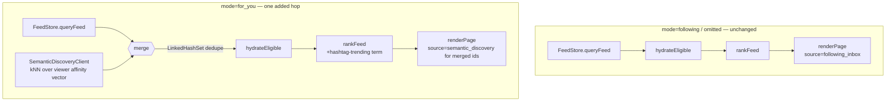
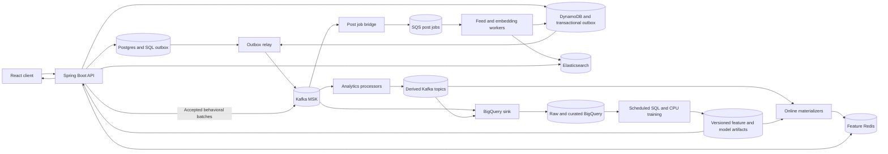
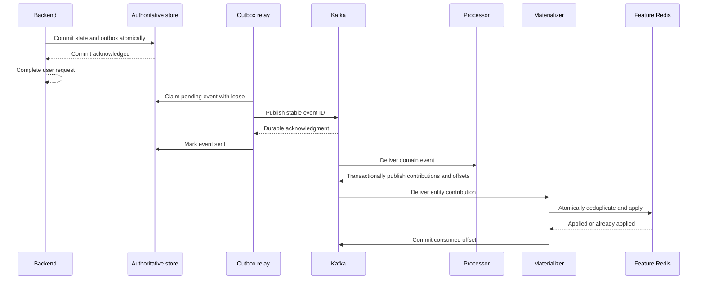
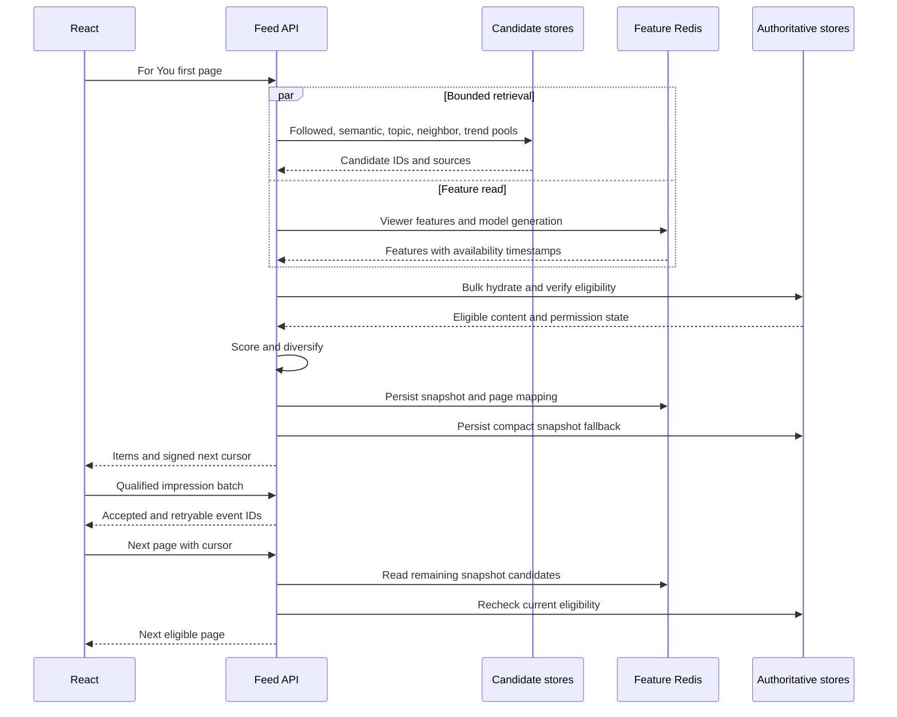
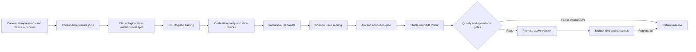

# Data Analysis and Personalized Feed System Design

**Status:** Implementation started. Durable outboxes, leased relays, v2 envelopes with typed session/request/experiment attribution, bounded impression/dwell/media collection, canonical event reconciliation with daily reach aggregates, feed-request lineage, qualified impressions, preliminary outcome labels, wall-clock relationship entity versions with version-guarded tombstones, idempotent like counters with receipts, observation retryable/503 handling with future-skew clamping, BigQuery timestamp validation with byte-size batching, lineage-preserving quarantine, ingestion-time partitioning, best-effort S3 recovery archive, Kafka analytics processor with receipts and time-bucketed trending, count-based feature materialization, deletion suppression ledger, history endpoints with explicit unavailable handling, fan-out failure transparency with embedding isolation and zero-vector skipping, private-account and media eligibility gating, and mode-bound feed snapshots (following/for_you/legacy) are implemented; full 500-candidate multi-pool retrieval with ANN alias, author timelines with hybrid push/pull, DynamoDB snapshot fallback, and learned ranking remain proposed and are not implied to be deployed.  
**Baseline inspected:** 2026-09-05, `/home/saldev/projects/escld`.  
**Audience:** Backend, data, frontend, infrastructure, and product engineers.  
**Decisions:** AWS application infrastructure plus BigQuery; approximately 100,000 daily active users; balanced personalization; phased, small CPU models.

## 1. Outcome and boundaries

Build a measurable recommendation loop: collect trustworthy exposure and interaction data, derive useful behavioral features, retrieve relevant candidates beyond followed accounts, rank them with explicit quality and diversity controls, and evaluate changes against user satisfaction and creator opportunity.

The first release uses explainable formulas and the existing MiniLM embeddings. The next release learns a small number of outcome probabilities using regularized logistic regression. Neither release requires an LLM, GPU inference, a large neural recommender, or a new vector database. No private messages, call audio, call recordings, email addresses, or birthdates enter recommendation training.

This document is both the target design and an implementation ledger. Section 2 identifies behavior already present in source; later sections include planned service changes, migrations, dashboards, and rollout gates that are not implied to be deployed. Existing source and infrastructure definitions do not establish actual production traffic or deployed resource health. Numerical thresholds are proposed configuration defaults and acceptance targets, not measured results.

### 1.1 Success criteria

- People discover relevant public content while retaining a predictable Following feed.
- Impressions are distinguishable from delivered items, and engagement rates use exposure denominators.
- Processing a duplicate event or adding consumer replicas does not inflate a metric.
- Feed access respects current visibility, moderation, deletion, and explicit hides, including when serving cached pages.
- Candidate and feature dependencies have bounded costs and timeouts; warehouse availability does not determine feed availability.
- Ranking changes can be explained, evaluated, rolled back, and compared using stable experiments.

## 2. Verified baseline and consequences

| Area | Current source behavior | Consequence for this design |
|---|---|---|
| Feed assembly | [FeedServiceImpl](../backend/src/main/java/com/escld/backend/services/impl/FeedServiceImpl.java) fetches `min(limit * 3, 90)` chronological DynamoDB candidates, hydrates content, and reranks a page. For `mode=for_you` specifically, [SemanticDiscoveryClient](../backend/src/main/java/com/escld/backend/search/SemanticDiscoveryClient.java) also merges real Elasticsearch kNN candidates (row 2 of section 6.1's target retrieval table — nothing more) into the pool before eligibility; see the diagram below. | For `mode=following` and the omitted/legacy path, retrieval is still limited to followed authors and self. For `mode=for_you`, ranking can now discover an unrelated creator for real — but no frontend caller sets `mode=for_you` yet, so this is real, tested capability with zero production traffic today, not yet a live behavior change for any user. |
| Personalization | Semantic affinity averages up to 20 authored-post embeddings; author/topic affinity uses recent likes and comments. | Reading interests and session intent are missing, especially for users who do not post. |
| Scoring | The additive weights are semantic 0.45, engagement 0.25, tags 0.15, post-trending 0.10, hashtag-trending 0.05, followed by affinity, follow-recency, live, and age factors. Hashtag-trending reads the platform-wide `trending:hashtags` Redis sorted set — computed by analytics since [`events.ts`](../analytics/src/events.ts) was written, but never read anywhere in the backend until [TrendingScoreClient.getHashtagScores](../backend/src/main/java/com/escld/backend/trending/TrendingScoreClient.java) — scored by the maximum across a post's own tags, not personalized to the viewer (contrast with the per-viewer `tags` affinity term). | Useful baseline, but raw engagement and compounded boosts are not calibrated outcome probabilities. |
| Pagination | Ranked IDs are retained in a 15-minute Redis snapshot and served through viewer-bound HMAC cursors; immutable offsets make retries return the same candidate slice. Legacy DynamoDB cursors remain accepted as source cursors. | Earlier revisions ranked only the current page slice and discarded unserved pagination candidates beyond the page; retained candidates are now no longer discarded between pages. DynamoDB snapshot recovery and page replacement CAS remain later hardening work. |
| Fan-out | [feed-worker](../feed-worker/src/event-handler.ts) embeds, indexes, then copies IDs to all followers. [Batch writing](../feed-worker/src/dynamo.ts) logs and returns after exhausting retries on unprocessed items. | Indexing can delay fan-out, celebrity work grows with followers, and partial delivery can be reported as success. |
| Trending | Each [analytics process](../analytics/src/index.ts) subscribes to Redis Pub/Sub and schedules shared-set decay, now guarded by a [Redis distributed lock](../analytics/src/trending-lock.ts) (`SET NX` acquire, Lua compare-and-delete release) so only one replica runs a given decay pass. [Infrastructure](../infra/lib/analytics-service-stack.ts) specifies two to four replicas. | Live two-process repro against a real Redis (not just unit tests) found the lock alone was insufficient the first time: `node-cron`'s own scheduling isn't sub-millisecond-precise, so two replicas' callbacks for the "same" tick can fire hundreds of milliseconds apart — long enough for a fast, near-empty-set decay pass to finish and release before the second replica's delayed callback arrives, letting it acquire and run too. Fixed by holding the lock a fixed few seconds past completion before releasing, negligible against the real multi-minute decay interval; re-confirmed clean across three consecutive live ticks afterward. Each replica still independently receives the same pub/sub events and increments shared scores — only the decay pass itself is now exclusive. |
| Trending (unwired) | A Kafka-consumer-group processor already exists ([`analytics/src/processor.ts`](../analytics/src/processor.ts) + [`bucketed-trending.ts`](../analytics/src/bucketed-trending.ts)) and would close the replica-multiplication problem above by construction — one partition, one owning replica, no decay cron. [`config.ts`](../analytics/src/config.ts) branches into it whenever `KAFKA_BOOTSTRAP_SERVERS` is set. | Not deployed: the analytics ECS task definition never sets that variable, so the legacy path above is what actually runs. It also targets consolidated topics (`domain.events.v2`/`behavior.events.v2`) that no current publisher writes to — the real per-event-type topics in the row below are what exists today. Written ahead of the cutover described in section 4.2, not a dead branch. |
| Event publishing | Relational aggregates write v2 events to the PostgreSQL outbox. Like, follow, and hide edges write to the shared `domain_outbox` table in the same DynamoDB transaction, and separate leased relays publish both outboxes to Kafka. | Relational and relationship state/event delivery is durable. Duplicate relationship requests do not create duplicate facts. |
| Warehouse | [bq-sink](../bq-sink/src/bigquery.ts) maps fifteen domain and observation types to raw tables and streams contiguous Kafka records in batches of up to 500. A long startup reconciliation, five-minute two-day merge, and daily 30-day repair select deterministic event-ID winners into `canonical_events`, remove conflicting IDs, materialize `feed_requests` and qualified `feed_impressions`, enrich impressions from ordered request lineage, and recompute 24-hour `impression_outcomes` from cumulative dwell, unique media completion, and final like, hide, follow, and comment lifecycle state. | Canonical request, impression, and available-event outcome facts exist. Finalized daily aggregates and live BigQuery validation remain to implement. Subscription coverage also depends on `KAFKA_TOPICS`; the local config defaults to `post.created`. |
| Eligibility | [FeedServiceImpl.hydrateEligible](../backend/src/main/java/com/escld/backend/services/impl/FeedServiceImpl.java) already excludes hidden posts (HideStore), media still `PROCESSING`/`FAILED`, and a private author's posts unless the viewer follows them or is the author, in that order, before scoring. | Moderation removal is explicitly not one of these checks yet — the code's own comment states no per-post removal index exists, so an open or actioned report does not suppress feed eligibility today. Section 6.3's moderation-aware eligibility is target design, not current behavior. |
| Creator insights | [PostInsightsService](../backend/src/main/java/com/escld/backend/insights/PostInsightsService.java) serves owner-only counters, trend score, and live metrics. | Historical reach, attributed engagement, and cohorts need materialized aggregates. |
| Telemetry | Feed responses include a request ID and viewer-bound observation token for every served position. Response assembly writes a best-effort durable `feed.served` event with ordered post IDs, positions, source/reason metadata, and continuation/snapshot flags; signed cursors and observation tokens are excluded. The browser records an impression only after 50% continuous foreground visibility for one second, reports cumulative foreground dwell every five seconds and on visibility exit, and tracks the union of watched video timeline ranges so seeking and replay cannot inflate completion. These observations use the bounded retry queue. `POST /api/v1/analytics/events` enforces a 64 KiB body boundary plus a distributed per-viewer bucket, validates observations, and persists accepted client event IDs through the SQL outbox. | Qualified impression/dwell/media collection, request attribution, and ingress limits exist. Feed serving stays available if lineage persistence fails and exposes a failure metric. Richer session metadata and retry-stable page IDs remain to implement; returned posts still must not be treated as impressions. |

Both modes run the identical `queryFeed -> hydrateEligible -> rankFeed -> renderPage` pipeline; `for_you` adds exactly one conditional hop — a real kNN merge, not a second parallel pipeline — and that hop disappears entirely for `following`/omitted:



`renderPage`'s `source`/`reasonCode` on each served item (`following_inbox`/`semantic_discovery`/`trending_hashtag`) is now real per-item provenance rather than the hardcoded constant every item used to carry — without this, the `feed.served` warehouse event (section 4.2) would have no way to ever measure whether either new signal actually changed what got served. One retained limitation: a snapshot-pagination page served by replaying a frozen ranked list (section 6.6) does not currently carry per-item provenance across pages, so a `for_you` item discovered on an earlier page reports as `following_inbox` if returned again from that frozen list.

The source also contains Kafka/MSK, BigQuery, live-stream infrastructure, and tracing additions that older overview text does not fully describe. Use source references above when planning changes; this document does not rewrite unrelated architecture history.

## 3. Target architecture and ownership



| Component | Responsibility and deployment decision |
|---|---|
| Spring Boot backend | Authentication, eligibility, feed orchestration, bounded scoring, ingestion validation, owner-only insights. Keep ranking in-process. |
| Outbox relay | Initially a scheduled Java backend component using short SQL leases, stable IDs, and broker acknowledgment. Keep the store/relay boundary so deployment can split into a dedicated worker when measured load or independent scaling requires it; add the DynamoDB adapter separately. |
| Analytics | Reuse the TypeScript package with separate API, processor, and materializer entrypoints. API replicas do not independently aggregate or run decay. |
| Feed worker | Keep SQS lanes, but separate fan-out work from embedding/indexing work and checkpoint recipient batches. |
| Kafka/MSK | Retain current managed broker. Independent consumer groups isolate warehouse, online features, and post job dispatch. |
| Feature Redis | Separate deployment from rate-limit/cache Redis at the growth target, preventing feature memory pressure from disabling API rate limiting. Rebuildable state. |
| Elasticsearch | Existing compact embeddings plus indexed public-content retrieval. No graph database or separate vector platform in this release. |
| DynamoDB | Existing graph and feed stores, plus transactionally recorded domain outbox items, author timelines, session fallback state, and deletion ledger as specified below. |
| BigQuery | Raw landing, canonical facts, versioned dimensions, creator/product marts, training datasets. Scheduled transformations every five minutes; daily finalized cohorts. |
| Scheduled data jobs | One Python CPU job image on ECS, invoked by EventBridge, using scoped GCP access for BigQuery exports and S3 for artifacts. Training uses pinned scikit-learn. |

All workers expose readiness, progress age, backlog, and dependency health separately from process liveness. Provision topic names, schema versions, IAM rights, and consumer groups through infrastructure configuration; do not rely on each process silently creating its own topic inventory.

## 4. Event contracts and reliable delivery

### 4.1 Canonical envelope

Keep existing `eventId`, `eventType`, `eventVersion`, `occurredAt`, and `payload`. Add the fields below in version `2`; consumers support versions `1` and `2` during migration. IDs in this example are illustrative.

```json
{
  "eventId": "01991062-0000-7000-8000-000000000001",
  "eventType": "post.liked",
  "eventVersion": "2",
  "occurredAt": "2026-09-05T12:00:00.000Z",
  "ingestedAt": "2026-09-05T12:00:00.050Z",
  "producer": "backend",
  "actorId": "user-17",
  "entityType": "post_like",
  "entityId": "post-42:user-17",
  "entityVersion": 3,
  "sessionId": "session-9",
  "requestId": "feed-request-8",
  "correlationId": "trace-2",
  "experiment": {"id": "feed-quality-1", "variant": "baseline"},
  "payload": {"postId": "post-42", "authorId": "user-88", "isLiked": true}
}
```

- `eventId` is assigned once at the original accepted transition or client observation and retained on retry. HTTP mutation idempotency keys map to that same accepted transition.
- `occurredAt` is server time for domain changes. Client observation time is accepted only inside the bounded ingestion window; `ingestedAt` always records server receipt.
- `entityVersion` increases on each authoritative state change, including reversals. Keep versioned relationship tombstones so unlike/re-like or unfollow/re-follow does not reset ordering. Behavioral observations use `observationSequence` in payload instead of a fabricated entity version.
- Actor identity is server-derived. Experiment assignment and feed source/position are resolved from signed serving context; client-supplied values do not become authoritative training fields.
- Event payloads are type-specific and allowlisted. Store schema definitions in the repository with compatibility tests; no additional schema-registry service is required initially.

### 4.2 Event inventory and ordering

| Family | Events | Authoritative source and key |
|---|---|---|
| Content | `post.created`, `post.updated`, `post.deleted`, `post.media_ready`, `post.visibility_changed`, `post.moderated`, `post.commented`, `comment.deleted` | SQL outbox; post or comment ID and its version |
| Relationships | `post.liked`, `post.unliked`, `user.followed`, `user.unfollowed`, `post.hidden`, `post.unhidden` | DynamoDB transaction; relationship ID and persistent version |
| Live | `live.started`, `live.ended` | SQL outbox; post ID; viewer heartbeats remain separately bounded observations |
| Observations | `feed.served`, `post.impression`, `post.dwell`, `media.progress`, `session.started` | Backend delivery or validated client batch; viewer ID as partition key |
| Privacy | `user.preferences_changed`, `user.deletion_requested`, `user.deletion_completed` | Durable authoritative workflow; user ID and version |

`user.deletion_requested`/`user.deletion_completed` are real `WarehouseEventPublisher` constants that `AccountDeletionServiceImpl` already calls — but [`KafkaConfig.warehouseTopics()`](../backend/src/main/java/com/escld/backend/warehouse/KafkaConfig.java)'s idempotent topic-creation list, `bq-sink`'s `KAFKA_TOPICS` env var, and `setup-gcp.sh`'s raw-table creation all currently cover the other 15 event types and omit these two. A deletion event publishes against a topic nothing has provisioned; it does not yet land a raw row in BigQuery. A known, small, independently fixable gap, not a design question — noted here so this inventory does not imply deletion events already flow into the warehouse today.

Continue legacy topics until their consumers migrate. New processing uses `domain.events.v2`, `behavior.events.v2`, and `privacy.events.v2`; derived topics are `features.user.v1`, `features.post.v1`, and `features.topic.v1`. Use twelve partitions for domain/behavior and each high-volume derived topic, three for privacy, and seven-day event retention. Final partition counts must pass the capacity test in section 11 before rollout. Do not increase partitions in place while relying on key order; migrate to a new topic generation with a cutover watermark.

Partition order is only order of arrival in one topic partition. It is not database commit order across relays or global order across topics. Relationship projections compare `entityVersion`; time-windowed observations use event time; duplicates use event ID. Deleted entities are checked against the deletion ledger regardless of topic arrival order.

### 4.3 Publication and consumer guarantees

Use a transactional outbox to couple a committed state transition with its event. This avoids the database/message dual-write gap described in [AWS guidance](https://docs.aws.amazon.com/prescriptive-guidance/latest/cloud-design-patterns/transactional-outbox.html); consumers still need idempotency.

For PostgreSQL, persist mutation and outbox row in one transaction, including changes made by media workers. Claim pending rows using short `FOR UPDATE SKIP LOCKED` transactions and leases; publish outside the claim transaction; mark sent only after broker acknowledgment. Retry with the original event ID after ambiguous acknowledgment. Retain sent rows for seven days and never expire unsent rows automatically. A PostgreSQL transaction committing a relational mutation and its outbox row must not imply atomicity across DynamoDB, and vice versa; each store's outbox guarantees per-store atomicity only, with cross-store consistency achieved via stable event IDs, idempotent consumers, and versioned reconciliation.

For DynamoDB, change both adjacency copies, the relationship version record, and an outbox item in one `TransactWriteItems` operation. Poll a sharded pending-outbox GSI using sixteen deterministic entity shards, then claim each item conditionally on the base table. GSI delay increases lag but does not remove unsent records. A sweeper reclaims expired leases. No required delivery path depends only on the limited DynamoDB Streams retention window. SQL counters become idempotent projections of these authoritative transitions with event receipt and counter change committed in the same SQL transaction; remove the old synchronous increment when that projection takes ownership.

For client observations, acknowledge only after Kafka acceptance with all required acknowledgments; partial failures return retryable event IDs. If the process dies after acceptance, the retry has the same event ID. Domain actions remain available while Kafka is down because their outboxes are durable; client observations can be lost when a device exits before acceptance and must be measured as incomplete telemetry.

Kafka-to-Kafka normalization uses transactions to publish derived contributions and input offsets together. KafkaJS provides [transactional production and offset commits](https://kafka.js.org/docs/transactions). Configure stable transactional IDs per owned input partition and committed-read consumers. Duplicate outbox events still require downstream deduplication: Kafka transactions do not deduplicate separate identical application events or atomically update Redis/BigQuery.

Each online contribution carries `(eventId, projectionVersion, entityKey)`. A bounded Redis script records that receipt and applies its contribution atomically in the same entity hash slot. A crash between updating a user projection and a post projection is safe: each projection has its own receipt and can finish on redelivery. Retain receipts for eight days, longer than broker retention. Replays older than that run into a new feature generation, never directly increment the live namespace. Relationship state uses newer entity versions and reversible state contributions; late reversals are reconciled against current state rather than blindly subtracting from an unrelated time bucket.

Rebuilds use a finalized warehouse feature snapshot at an ingestion watermark plus a buffered Kafka tail. Include a dedup manifest for the overlap interval and exclude events already incorporated into the snapshot. Validate counts before atomically switching the feature-generation pointer. Keep serving the previous generation during rebuild; if both are unavailable, fall back without personalization.

After five bounded attempts at a deterministic validation failure, write a restricted quarantine record with payload reference, schema error, and original topic/partition/offset, then commit the input offset. Never log full behavioral payloads. Transient broker, store, or authentication failures pause affected consumption and alert; they are not classified as malformed data. Unknown event versions follow quarantine policy instead of being silently dropped. Redrive preserves the original event ID.



## 5. Behavioral measurement and feature system

### 5.1 Observation semantics

- **Delivered:** `feed.served` contains the returned post IDs, positions, retrieval sources, model/config versions, request ID, and assignment. It means response assembly, not confirmed device receipt. Emit once per page identity, even when the HTTP response is retried.
- **Impression:** at least 50% of a post card visible continuously for one second while the document is foregrounded. Record once per post per feed session. Scrolling past faster is not a negative label.
- **Dwell:** foreground, visible time only. Send cumulative `activeDwellMs` and increasing observation sequence every five seconds and on visibility exit; apply only increases. Cap training dwell at 60 seconds per post/session.
- **Playback:** send cumulative unique media milliseconds viewed and milestone observations at 25/50/75/95%. Exclude paused/buffering time; repeated playback does not inflate completion beyond one. Separate live viewing from finite-video completion.
- **Negative feedback:** a hide immediately excludes that exact post. A qualified impression with dwell below two seconds and no engagement after label maturity is a weak skip signal; it is not interchangeable with a hide. Reports remain access-controlled and influence eligibility only through moderation decisions.
- **Session:** an authenticated visit with a client session UUID; expire after 30 minutes of inactivity. A feed pagination snapshot expires separately after 15 minutes.

The frontend uses visibility observation and a bounded memory retry queue of 200 observations; flush at 20 events or five seconds, with exponential retry up to the 24-hour acceptance window. Discard oldest dwell updates before discrete impressions when full. Do not persist behavioral queues to device storage initially. Emit delivery/drop counters without raw content. `sendBeacon` is not assumed to carry bearer authentication; use the existing authenticated client with a small keepalive request on page exit, best effort.

### 5.2 Feature definitions

| Feature group | Definition | Freshness and bounds |
|---|---|---|
| Session taste | Weighted normalized embedding centroid of qualified viewed/engaged posts | 30-minute half-life; 100 most recent qualifying items |
| Long-term taste | Weighted centroid with a 14-day half-life | 90-day maximum history; daily snapshot plus online contributions |
| Author/topic affinity | Decayed positive and negative evidence counts, each capped per viewer/post/day | 14-day half-life; top 100 authors and 100 topics per active viewer |
| Post quality | Unique exposed viewers, meaningful engagement rate, hide rate, qualified dwell | 5-minute, 1-hour, 24-hour, and 7-day event-time windows |
| Trend velocity | Smoothed qualified engagement in last 15 minutes versus the preceding 45 minutes | Recompute each minute; minimum 20 exposed viewers |
| Creator opportunity | Rolling exposure share and impressions received by new posts | 24-hour window; used for bounded exposure controls |
| Seen history | Qualified impressions, not every candidate retrieved | Seven-day TTL; newest 2,000 post IDs per viewer |
| Eligibility | Current content status, account privacy, relationship permission, hide state | Authoritative reads at serving; feature caches are not authorization |

Positive profile weights are qualified dwell 1, like 2, comment 3, and an attributed follow 4, with combined weight capped at 5 per post/session. A hide contributes separate negative evidence with weight 5; do not subtract embeddings and create unstable vector norms. Bound topic penalties to 0.15 and author penalties to 0.20; one hidden post must not silently block all unrelated content by that author.

For positive vector observations `e_i`, compute `v = normalize(sum(w_i * 2^(-age_i / half_life) * e_i))`. Combine a valid session and long-term vector as `normalize(0.3 * v_session + 0.7 * v_long)`. If one is absent, use the other; if neither exists, omit semantic personalization. Do not use authored content as the default consumption profile. Skip zero, non-finite, and wrong-dimension embeddings; record coverage by content type and language. Media-only posts use engagement, topic, author, and freshness features until metadata provides usable text.

Redis keeps bounded time buckets and receipts per entity; trending reads sum weighted buckets by age, so no global multiply-every-member decay pass is needed. Start with exact deduplicated event receipts and per-window viewer counts; measure memory before introducing approximate cardinality, and label any approximate metrics in APIs. Expire inactive feature keys after 30 days; restore returning users from a permitted offline snapshot.

Every feature value carries `featureVersion`, `computedAt`, `maxOccurredAt`, `availableAt`, and `generation`. Training joins require both event time and actual availability to precede the ranked request. Daily offline recomputation compares feature samples with online values, using tolerance 1e-5 for floating-point features and exact equality for finalized counts.

## 6. Retrieval, ranking, and feed sessions

### 6.1 Modes and candidate retrieval

An omitted mode retains the legacy feed path and cursor decoder. Explicit `following` serves eligible followed authors and self in reverse chronological order. Explicit `for_you` uses the pipeline below. The frontend initially opts into For You only for the experiment cohort; Following stays available to everyone.

Retrieve these pools concurrently for the first For You page. Counts are initial source budgets, not exposure quotas:

| Source | Maximum candidates | Method |
|---|---:|---|
| Followed authors and self | 200 | DynamoDB inbox merged with followed pull-author timelines |
| Semantic discovery | 120 | Filtered ANN over public eligible post embeddings |
| Topic discovery | 60 | Top topics from viewer profile, freshness-bounded search |
| Engagement neighborhood | 40 | Daily co-engagement item neighbors from public content |
| Trending | 50 | Language/topic trend buckets with qualified exposure minimum |
| New creator opportunity | 30 | Public posts with low exposure, account/content quality eligibility |
| **Total before deduplication** | **500** | Deduplicate by post ID and retain all source attribution |

For engagement neighborhoods, compute item-to-item co-engagement offline from qualified public interactions: cosine-normalized co-view counts with at least 20 distinct viewers and 50 neighbors per item. Ignore private-content interactions in the shared graph. Retrieve neighbors of up to ten recent qualified items and cap the merged pool at 40. This is collaborative retrieval without a large learned model or graph database.

Use the existing 384-dimensional MiniLM model, versioned as `minilm-l6-v2:1`; add model version, content version, language, visibility, moderation state, and indexed date fields to a new search-index generation. Use cosine ANN with `k=120` and initial `num_candidates=600`, then benchmark recall and latency. Filter public discovery during ANN retrieval; [Elasticsearch pre-filtering](https://www.elastic.co/docs/solutions/search/vector/knn) and final authoritative eligibility checks serve different purposes. Reindex behind an alias and validate before switching. Never index an all-zero vector as a cosine-search candidate.

Ordinary candidates are at most seven days old, while current followed live posts remain eligible independently of announcement age. A cold-start user gets followed content, selected language/topics, qualified trends, and new-creator candidates. With no topic preferences, use UI language and globally qualified public content; do not infer location or sensitive interests.

### 6.2 Hybrid fan-out

Authors with fewer than 10,000 followers use push delivery. Authors crossing that threshold use pull delivery from a time-ordered author timeline. Apply hysteresis: switch back to push only below 8,000 followers for seven consecutive days. Store mode and effective cutover time with the author metadata.

All posts enter author timelines, regardless of fan-out mode. Split recipient discovery into pages of 1,000 and durable fan-out jobs containing recipient page/checkpoint, content version, and deterministic job ID. Checkpoint a page only after every write succeeds; exhausted unprocessed writes throw and retain retry/DLQ evidence. Embedding failures must not prevent followed posts appearing in the feed.

During a mode transition, keep both retrieval paths active for seven days and deduplicate by post ID. Store complete follow graph projections through paginated change processing. For pull retrieval, batch up to 50 subscribed author timelines per request; viewers following more pull authors use a cached recent-post merge, rebuilt on refresh from paginated subscriptions with a two-second background budget. Surface staleness and complete the remaining merge asynchronously; do not issue unbounded author queries inside the feed request. New follows immediately backfill the latest 20 eligible posts independently of creator mode.

### 6.3 Eligibility before relevance

Bulk-check authoritative content and author state, explicit hides, and required current follow edges before ranking and again before returning a cached page. Public discovery never includes private accounts. Following may include a private author only with an accepted current edge. Pending requests grant no access. Use primary PostgreSQL reads for visibility/deletion and strongly consistent DynamoDB base-table reads for permission-sensitive edges and hides; do not rely on a stale GSI for permission.

Exclude deleted/moderated posts, ended-live-only announcements without playable replay, and media still processing or failed. Live eligibility comes from current post state. Unfollowing removes an author from Following; their public content can remain discoverable in For You. The existing hide action excludes one post, and does not imply a new mute/block feature.

If authorization state cannot be established, omit those candidates. If the authoritative content store is unavailable, return a retryable error rather than treating cached content as current authorization. Ordinary concurrent state transitions are evaluated at the final read; the system cannot revoke bytes already delivered before a later privacy change.

### 6.4 Phase A scoring formula

For normalized signals in `[0,1]`, use:

```text
semantic = (1 + cosine(viewer_vector, post_vector)) / 2
topic    = positive_topic_evidence / (positive_topic_evidence + 5)
author   = positive_author_evidence / (positive_author_evidence + 5)
quality  = (qualified_engaged_viewers + 2) / (qualified_exposed_viewers + 20)
fresh    = 2 ^ (-max(age_hours, 0) / 48)
trend    = sigmoid(log((engagement_15m + 2) / (engagement_prev45m / 3 + 2)))
base     = weighted_mean(semantic:.30, topic:.20, author:.15,
                         quality:.15, fresh:.15, trend:.05)
score    = clamp(base - negative_author - negative_topic
                 - .25 * smoothed_hide_rate + .05 * is_currently_live, 0, 1)
```

One viewer contributes at most one meaningful engagement to a post within a quality window; counts share the same qualified-exposure population and window. The Beta(2,18) quality prior gives an unexposed post a 0.10 prior mean, avoiding both zero-quality and guaranteed-viral cold starts. Require 20 exposed viewers for trend velocity; below that, omit the trend signal.

Omit unavailable semantic/topic/author/trend features and renormalize their remaining weights. A complete profile with evidence of no affinity has value zero; an absent profile is missing. Freshness and prior-based quality remain available. All-negative or zero scores still sort deterministically by creation time and post ID. Log feature coverage and each score component for a 1% restricted diagnostic sample.

### 6.5 Diversity and exploration

Greedily build a page using `adjusted = 0.85 * score - 0.15 * max_similarity_to_selected`. Use nonnegative cosine similarity, bounded to `[0,1]`, for redundancy; when embeddings are missing, use topic Jaccard similarity. Allow at most two posts by one author in 20 results, avoid adjacent same-author posts when alternatives exist, and cap a dominant topic at 40% of the page. Carry the last served author across page boundaries.

Reserve one slot per 20 results for exploration once the logged-exploration gate in section 10 passes. Rotate its position across slots 5 through 20 by a stable session seed. Select uniformly from up to 30 eligible discovery candidates within 0.15 of the best available base score, after diversity checks. Log the exact eligible pool, seed/version, pool size, and conditional selection probability `1 / pool_size`. This probability supports evaluation of the exploration policy only; it is not a propensity for deterministic retrieval or every exploitation position.

Before that gate, the opportunity pool participates in deterministic ranking with `exploration=false`. If supply is scarce, relax topic caps first, then author caps; never relax privacy, hides, moderation, or deletion. Exploration is skipped when no candidate meets the quality floor.

Worked example, after eligibility and scoring:

| Post | Author | Topic | Base score | Outcome |
|---|---|---|---:|---|
| P1 | A | Rust | 0.82 | Selected first |
| P2 | A | Rust | 0.80 | Deferred: same author and redundant content |
| P3 | B | Systems | 0.77 | Selected next for relevance and diversity |
| P4 | C | Databases | 0.74 | Strong discovery candidate |
| P5 | D | Graphics | 0.68 | Eligible exploration candidate if within the live pool's score floor |
| P6 | E | Systems | 0.91 | Removed before scoring output because currently private and not followed |

The actual second selection compares adjusted scores, not the base-score column alone. For example, P2 with similarity 0.95 to P1 scores `0.85*0.80-0.15*0.95=0.5375`, while P3 with similarity 0.20 scores `0.6245`.

### 6.6 Snapshot pagination and orchestration

Retain ranked candidate IDs, source cursors, feature/config/model versions, experiment assignment, and a fixed seed for 15 minutes. Use Redis for snapshots and a compact DynamoDB snapshot copy for cache-loss recovery; no post bodies or private feature vectors are stored in cursor payloads. Up to 500 candidates can be emitted from a snapshot; when exhausted, `nextCursor=null` and the client explicitly refreshes for a new snapshot. This first release does not promise an infinitely growing session.

Signed cursors carry `cursorVersion`, snapshot ID, next offset, mode, expiry, and viewer binding. The signing key ID permits rotation. Cache each materialized page for idempotent retries and revalidate its eligibility before returning; replacements come from later unseen snapshot candidates, with the materialized page mapping updated atomically. New hides/deletions may intentionally change a retry's visible contents. Concurrent page materialization uses compare-and-set so retries cannot allocate two different offsets or emit the same candidate into two pages.

```text
serve(viewer, mode, limit, cursor):
  if mode omitted: serve compatible legacy path with current eligibility checks
  validate viewer-bound cursor or create snapshot using bounded parallel retrieval
  load snapshot; expired -> FEED_SESSION_EXPIRED
  select unseen candidate slice; hydrate and bulk-check eligibility
  rank and diversify unmaterialized page; backfill holes within snapshot budget
  atomically persist page mapping and next offset
  revalidate eligibility; map DTOs with signed observation context
  record best-effort feed.served with stable page event ID
  return items, nextCursor, requestId, sessionId, metadata
```

After a refresh, suppress posts with qualified impressions in the last seven days when enough unseen supply exists. In Following, seen posts remain accessible and keep chronological order. In a sparse For You corpus, permit repeats across refreshed sessions with a `repeated_content` reason; never repeat within one snapshot. Ranking scores are not exposed to end users.



## 7. API and artifact contracts

### 7.1 Feed and observation API

Keep `/api/v1/feed`, existing `items`, existing `nextCursor`, the default limit of 20, and the maximum limit of 50. New metadata is optional and additive; legacy cursors are accepted only on the legacy path. Explicit Following uses snapshot pagination with chronological ordering; explicit For You uses ranked snapshots. A cursor cannot be reused across modes or viewers.

```json
{
  "items": [],
  "nextCursor": null,
  "requestId": "feed-request-8",
  "sessionId": "feed-snapshot-9",
  "metadata": {
    "mode": "for_you",
    "rankingVersion": "rules-1",
    "featureVersion": "features-1",
    "degraded": false,
    "expiresAt": "2026-09-05T12:15:00Z"
  }
}
```

Each new-mode item optionally includes `recommendation: {source, reasonCode, observationToken}`. Reason codes are `following`, `topic_interest`, `similar_content`, `trending`, `new_creator`, and `repeated_content`; detailed affinity values are internal. `observationToken` signs viewer, post, request, position, mode, experiment, and expiry for attribution without a Redis lookup per observation.

`POST /api/v1/analytics/events` accepts at most 50 events and 64 KiB of uncompressed JSON. It is authenticated, rejects client-supplied actor identities, and accepts only client observation event types. Domain likes/follows/hides come from their normal APIs. Set a per-user token bucket of 120 batch requests/minute, burst 20, plus ingress byte limits. Accept observation timestamps up to 24 hours old and two minutes ahead; clamp tolerated future skew to receipt time and record original client time separately. Observation tokens remain valid for 24 hours even though feed cursors expire after 15 minutes.

```json
{
  "events": [
    {
      "eventId": "01991062-0000-7000-8000-000000000002",
      "type": "post.impression",
      "occurredAt": "2026-09-05T12:00:02Z",
      "sessionId": "session-9",
      "observationToken": "signed-server-context",
      "payload": {"postId": "post-42", "visibleDurationMs": 1200, "visibleFraction": 0.75}
    }
  ]
}
```

Return `202` with `acceptedEventIds`, `rejected: [{eventId, code}]`, and `retryableEventIds`; clients retry only retryable or acknowledgment-unknown IDs. Use `400` for an invalid envelope, `401` for missing auth, `413` for oversized requests, `429` with `Retry-After` for rate limits, and `503` when no valid event could be durably accepted. Per-event errors do not reject unrelated valid events. Strict finite-number and duration bounds apply to all observation values.

Cursor errors are `400 INVALID_FEED_CURSOR` for malformed, tampered, viewer/mode-mismatched cursors, and `410 FEED_SESSION_EXPIRED` for expired or irrecoverably unavailable snapshots. The latter response instructs the updated client to refresh; it does not silently restart page one. Explicit new-mode errors do not alter the legacy contract.

### 7.2 Insights and feature/model artifacts

Keep existing post insights unchanged. Add owner-only `GET /api/v1/posts/{postId}/insights/history?from=YYYY-MM-DD&to=YYYY-MM-DD&granularity=day` and `GET /api/v1/users/me/insights` with the same dates. Use UTC, inclusive `from`, exclusive `to`, default seven days, maximum 90 days. Materialize daily series through the exporter into DynamoDB and cache in Redis; zero means measured zero, while unavailable or incomplete data returns nullable metrics with `dataStatus` and `asOf`. Return `503` if neither materialized store can answer. Suppress fine-grained audience breakdowns with fewer than 20 distinct viewers. Product cohorts and individual observation records are not creator APIs.

Publish immutable model bundles to S3 containing `modelVersion`, checksum, feature schema/version, ordered feature names, normalization parameters, intercepts/coefficients, calibration parameters, training cutoff, metrics, and promotion status. Java downloads on startup and periodically checks an atomic active-version pointer; it validates dimensions and checksum before swapping. Keep the previous model loaded for rollback. Feature snapshots likewise carry generation, ingestion watermark, overlap manifest, and schema checksum. No deserialization of arbitrary Python objects occurs in the backend.

## 8. Warehouse model and analysis

### 8.1 Tables, transformations, and correctness

Retain `escld_events_raw` as the landing dataset and legacy per-type tables during migration. Add v2 raw tables per domain/observation type with a common typed envelope and JSON payload. Partition by `DATE(ingestedAt)` and cluster by `eventType`, `actorId`, and `entityId` where applicable. High-volume observation records are batched at 500 rows, 1 MiB, or one second, whichever comes first. Retry only failed rows when the API returns partial errors; commit Kafka offsets only through the contiguous successfully landed or durably quarantined prefix per partition.

Legacy streaming `insertId` is best-effort deduplication, as documented by [BigQuery](https://docs.cloud.google.com/bigquery/docs/write-api-rest); its protection is [best effort](https://cloud.google.com/blog/topics/developers-practitioners/bigquery-write-api-explained-overview-write-api) and must not be relied on for guaranteed deduplication. Canonical facts therefore choose one validated record per `eventId`, with deterministic ingestion/offset ordering. Conflicting payloads for the same ID trigger quarantine. A replay is expected to duplicate raw rows and must not duplicate canonical metrics.

Curated dataset `escld_analytics` contains:

| Table/view | Grain and purpose |
|---|---|
| `canonical_events` | One event ID after validation, deduplication, and deletion suppression |
| `feed_requests` | One materialized request/page with assignment and ranking versions |
| `feed_impressions` | One qualified viewer/post/feed-session impression, linked to served position |
| `impression_outcomes` | One impression with matured meaningful-engagement, hide, dwell, and follow labels |
| `post_versions`, `user_profile_versions` | Effective and available timestamps for point-in-time content/eligibility dimensions |
| `post_daily`, `creator_daily` | Finalized UTC daily reach and outcome aggregates; include provisional/as-of fields |
| `user_daily`, `retention_cohorts` | Qualified sessions, activity, activation, and D1/D7/D30 return |
| `experiment_assignments`, `experiment_daily` | Assignment/exposure facts and user-level aggregated outcomes |
| `training_examples` | Ranked request features as available then, label maturity, sampling weights, versions |

Five-minute jobs merge newly ingested events and recompute affected event-time partitions; a daily job reconciles the previous 30 days. Older domain corrections enqueue explicit repair partitions. Client events older than 24 hours are rejected, but server-origin outbox backlog can legitimately arrive later and still repair historical facts. `MERGE` uses a deduplicated source and event-ID match; partition pruning must include each affected target partition, including old dates identified by late arrivals. Do not restrict the target to the current day and accidentally reinsert an older event ID.

### 8.2 Metric dictionary and attribution

| Metric | Definition |
|---|---|
| Qualified reach | Distinct viewers with a qualified impression in the selected period; daily distinct counts cannot be summed into period reach |
| Meaningful engagement rate | Impressions with a like, nondeleted comment, active dwell of at least 10 seconds, or finite-video completion of at least 50%, divided by qualified impressions |
| Negative feedback rate | Impressions followed by an explicit hide within 24 hours divided by qualified impressions |
| Discovery-to-follow conversion | Distinct viewer/creator pairs with an attributed follow within 24 hours divided by distinct exposed nonfollowed viewer/creator pairs |
| Dwell | Capped active dwell per impression; report median and p90 plus collection coverage |
| Activation | New users who follow at least three creators and have five qualified impressions within seven days of signup |
| D1/D7/D30 retention | Users with a qualified foreground session on that UTC day offset divided by the mature signup cohort; report immature cohorts as null |
| Creator concentration | Share of qualified impressions received by the top 1% of exposed creators, alongside distinct creators per session |
| Feed coverage | Attributed observed impressions divided by reported impressions, plus served/observed counts separately; never call undelivered-to-view a logging failure |

For a domain action, attribute to the latest preceding qualified impression for the same viewer/post within 24 hours; a creator follow uses the latest eligible discovery impression for that viewer/creator. Assign at most one impression per action. Session-only dwell/playback joins by signed context. Preserve unexposed actions in canonical domain facts but exclude them from impression-denominated metrics. Unlike/unfollow and deleted comments resolve the state at label maturity, not an arbitrary later retraining date. Future unlikes must not rewrite what was known at the original label cutoff.

Finalize labels 24 hours after an impression plus a 24-hour late-arrival allowance. Newly repaired data may revise historical analytics; training artifacts stay immutable and a repair creates a new dataset version. Engagement indicates an observed behavior, not proven satisfaction; retention and explicit negative feedback remain separate guardrails.

### 8.3 Representative BigQuery SQL

These queries target the proposed curated schema, not tables already present. Replace `PROJECT_ID` with the deployment project. SQL parameters are supplied through the query API.

```sql
-- Grain: one eventId. Include affected ingestion partitions on replay.
SELECT * EXCEPT (dedup_rank)
FROM (
  SELECT e.*,
    ROW_NUMBER() OVER (
      PARTITION BY eventId
      ORDER BY ingestedAt, sourceTopic, sourcePartition, sourceOffset
    ) AS dedup_rank
  FROM `PROJECT_ID.escld_analytics.validated_events` AS e
  WHERE DATE(ingestedAt) BETWEEN @ingestion_from AND @ingestion_to
)
WHERE dedup_rank = 1;
```

The deduplicated batch above is input to an event-ID `MERGE` against the full affected canonical target, not an independent append. `validated_events` is the union view over typed landing records after schema and deletion checks; source offset is numeric.

```sql
-- Period reach and matured outcomes: do not sum daily distinct reach.
SELECT
  authorId,
  COUNT(DISTINCT actorId) AS qualified_reach,
  COUNT(*) AS qualified_impressions,
  SAFE_DIVIDE(COUNTIF(meaningful), COUNT(*)) AS engagement_rate,
  SAFE_DIVIDE(COUNTIF(hidden), COUNT(*)) AS hide_rate,
  APPROX_QUANTILES(activeDwellMs, 100)[OFFSET(50)] AS median_dwell_ms
FROM `PROJECT_ID.escld_analytics.impression_outcomes`
WHERE DATE(impressionAt) >= @from_date
  AND DATE(impressionAt) < @to_date
  AND labelMaturedAt <= @as_of
GROUP BY authorId;
```

```sql
-- Training features must have existed before the request was scored.
SELECT
  r.requestId, r.actorId, r.postId, r.rankedAt,
  f.featureVersion, f.features
FROM `PROJECT_ID.escld_analytics.ranked_candidates` AS r
JOIN `PROJECT_ID.escld_analytics.feature_snapshots` AS f
  ON f.actorId = r.actorId AND f.postId = r.postId
  AND f.maxOccurredAt <= r.rankedAt
  AND f.availableAt <= r.rankedAt
WHERE DATE(r.rankedAt) BETWEEN @train_from AND @train_to
QUALIFY ROW_NUMBER() OVER (
  PARTITION BY r.requestId, r.postId
  ORDER BY f.availableAt DESC, f.snapshotId DESC
) = 1;
```

`ranked_candidates` is the restricted diagnostic/training view of logged candidate evaluations; `feature_snapshots` stores the exact normalized input vectors used for those evaluations. For the initial models, prefer that exact request vector over reconstructing it later. Unshown candidates have no observed outcome label and are excluded from supervised examples. The join illustrates the constraint for later historical reconstruction.

## 9. Privacy, retention, and deletion

Treat user vectors, Redis profiles, exposure histories, and pseudonymous warehouse IDs as behavioral personal data. This extends the older Redis classification in [DATA_CLASSIFICATION.md](DATA_CLASSIFICATION.md), which predates personalized Redis features; aggregate counts are not automatically anonymous when groups are small.

Proposed operational defaults, subject to the product's adopted retention policy:

| Data | Retention/default |
|---|---|
| Kafka event log | Seven days |
| Online dedup receipts | Eight days; rebuild instead of applying older replay to live state |
| Sent outbox entries | Seven days; unsent entries retained until resolved |
| Feed snapshots / seen history | 15 minutes / seven days with a 2,000-item cap |
| Online profiles | 30 days inactive; at most 90 days of contributing history |
| Raw behavioral events and request feature samples | 90 days; diagnostic feature logging sampled at 1% |
| Row-level canonical events and training data | 90 days; daily bounded aggregates retained 13 months |
| Model artifacts and manifests | Active and previous model plus 90 days of versioned history |
| Restricted quarantine | 14 days with payload references and limited access |

Do not make the 1% diagnostic feature sample the only ML dataset silently: choose a deterministic 10% user sample for full shown-item training vectors during Phase B data collection, version the sample rule, and account for its storage cost separately. No raw text is required in these feature logs.

Personalization defaults on for authenticated feed use, with a settings control to disable behavioral profiling and reset interests. When disabled, retain explicit Following behavior and serve unpersonalized eligible discovery; exclude that user's observations from profiles/training. Keep necessary domain events for application operation under existing access rules. Settings are read at ingestion and again when materializing/training to handle races.

Account deletion adds a durable suppression ledger before removing derived state. It covers actor IDs and owned entity IDs, cancels active feed snapshots, deletes profiles and warehouse rows, and invalidates export/training manifests containing the subject. Relays and replay jobs consult this ledger so old events cannot recreate deleted records. Ingest rejects observations for deleted identities; published events are suppressed downstream. Retain the restricted deletion marker through the maximum restore/replay horizon, including backups; the default is 13 months and backup retention must not exceed that horizon without extending it.

The deletion workflow checkpoints per store and retries until completion. Online suppression takes effect on acceptance; target online derived deletion within 15 minutes and warehouse/artifact cleanup within seven days. A model trained on subsequently deleted data is replaced by a clean retrain within seven days, with stale artifacts retired; do not claim that deleting training rows instantly removes model influence. Restores must apply the suppression ledger before becoming readable. This is an operational design, not a claim of legal compliance.

## 10. Lightweight ML and experimentation

### 10.1 Model and training decisions

Phase A rules remain the baseline and fallback. Phase B trains two L2-regularized logistic models: `P(meaningful engagement | qualified impression)` and `P(explicit hide | qualified impression)`. Start with at most 64 numeric features: the rule signals, bounded recency transforms, interaction windows, language/content-type indicators, feature-missing flags, and limited cross-products such as semantic affinity times freshness. No raw user/post IDs, demographic attributes, text generation, or neural fine-tuning.

Use [scikit-learn LogisticRegression](https://scikit-learn.org/stable/modules/generated/sklearn.linear_model.LogisticRegression.html) in a pinned CPU training environment. Standardize continuous features using training-only statistics; clip to the training p1/p99 range; missing numeric values use the training median plus missing flags. Use `C=1.0`, L2, deterministic seed 17, and at most 500 iterations initially. Train on all available labels within the selected user sample without oversampling; add sigmoid calibration fitted only on validation data. Java implements the exported dot products and sigmoid, with parity fixtures produced by Python.

Train daily on the last 28 days of mature examples, split chronologically into 21 training, four validation, and three test days. Start only after at least 100,000 qualified impressions from 5,000 users, 1,000 positive meaningful labels, and 500 hides are present. The hide head remains the rule-based penalty until its threshold is met; the positive head can launch separately. Insufficient data retains the existing approved model or rules. These thresholds establish a minimum dataset, not statistical proof of effectiveness.

The learned utility is `0.70 * p_meaningful + 0.15 * fresh + 0.10 * topic + 0.05 * author - 0.50 * p_hide`, with missing affinity terms renormalized within their positive weights. Clip the final utility to `[0,1]`, keep the same eligibility/reranking constraints, and retain separate score components. Initial model bundle limit is 1 MiB and scoring target is p95 below 5 ms for 500 candidates on the backend CPU; benchmark before promotion.

No larger-model phase is required by this roadmap. If simple models plateau, first improve labels, retrieval coverage, and feature quality. A different model family requires a separate measured proposal.

### 10.2 Evaluation and rollout gates

- Run time-split offline evaluation with log loss, Brier score, calibration error, and NDCG@20 on observed eligible impression slates. Report results by new/returning users, content type, language, and creator exposure decile. Sparse groups are combined or flagged, not treated as reliable lifts.
- Observe selection bias: logged displayed content is not a ground-truth label for every retrieved candidate. Do not label unseen candidates as negatives. Offline NDCG is diagnostic, not a causal claim about a new retrieval policy.
- Use stable user-level hashing for experiment assignment; persist the experiment ID, salt version, variant, exposure time, and allocation. Changing ramp allocation must not move already enrolled users between variants. Run A/A first and check assignment balance and attribution integrity.
- Primary online metric is meaningful engagements per qualified impression, aggregated with user-level inference; guardrails are hides, D7 retention, creator concentration, diversity, API errors, and latency. User assignment is not independent per impression. State social-graph interference as a limitation and inspect creator-level exposure effects.
- Determine sample size from A/A variance for a 2% relative primary-metric effect, 80% power, and two-sided 5% significance; freeze the required sample before experiment analysis. Each comparison runs at least 14 days and until its sample is met, with the final seven days allowed to mature for D7. Do not promote by repeatedly peeking at ordinary confidence intervals.
- Promote only if the primary metric's 95% interval is above zero, the hide-rate increase is below 0.2 percentage points, D7 decline is below one percentage point, and creator concentration worsens by less than two percentage points. Treat inconclusive guardrails as insufficient evidence to promote. Immediate operational rollback does not wait for statistical significance.

Deploy in shadow first, then 1%, 5%, 25%, and full traffic after gates pass. Shadow scoring does not change items or manufacture impressions. Keep rule/config/model versions and a single backend feature flag for rollback. Roll back on invalid model numbers, eligibility failures, or sustained SLO breaches. An alert pauses new promotions when feature freshness or attribution coverage is degraded.

Phase C introduces the bounded 5% exploration policy in section 6 only after A/A passes and at least 99% of accepted exploration impressions join to their served context. Evaluate alternative exploration policies with clipped inverse-propensity weighting only where support is known, report effective sample size, and retain a randomized holdout. Do not deploy an autonomous online bandit in this roadmap; controlled randomized exploration is the chosen initial approach.



## 11. Capacity, reliability, and operating cost

### 11.1 Capacity assumptions and latency budget

| Input | Calculation | Planning load |
|---|---|---:|
| Feed requests | 100,000 DAU x 20/day | 2,000,000/day; 23.2/s average; 232/s at 10x peak |
| Qualified impressions | 100,000 DAU x 200/day | 20,000,000/day; 231.5/s average; 2,315/s peak |
| All behavioral records | Four events per impression, including capped progress/dwell | 80,000,000/day; 926/s average; 9,260/s peak |
| Raw behavioral payload | 600 bytes/event before compression | 48 GB/day; 4.32 TB over 90 days before indexing/replication |
| Serving output upper bound | 2,000,000 requests x 20 returned items | 40,000,000 delivered item records/day; budget separately from client observations |
| Concurrent retained feed snapshots | Worst case 15 minutes of peak new requests | 208,800 snapshots; about 3.34 GB at 16 KiB/snapshot before Redis overhead and page mappings |

A 16 KiB snapshot is a compact binary ID/metadata target, not a JSON guarantee. Benchmark actual bytes per candidate, receipt, and profile. At 80 million behavioral events/day, eight-day per-event receipts can dominate Redis memory; measure per-projection amplification and allocate receipt capacity explicitly. Prefer cumulative observation coalescing and event-type-specific receipts for progress before adding capacity. Do not provision Redis based solely on the vector size or DAU.

New-mode feed targets: 99.9% monthly successful eligible responses, p95 <=300 ms, p99 <=800 ms under planned peak. These are load-test targets, not measured capabilities. Provisional p95 budget: authentication and routing 20 ms, concurrent retrieval/features 90 ms, hydration/eligibility 70 ms, scoring/reranking 20 ms, snapshot persistence and response 50 ms, reserve 50 ms. Per-stage percentiles do not mathematically sum to an end-to-end percentile; load tests determine whether this budget is achievable.

Use a 600 ms internal request deadline, leaving response overhead below the p99 target. Cap candidate pool at 500 and concurrent candidate-source calls at six. Time out optional retrieval after 100 ms; bulk authoritative work gets the remaining budget and cannot be skipped for speed. Feature freshness target is <=60 seconds p95; curated analytics <=15 minutes p95; indexing and ordinary fan-out <=60 seconds p95. These freshness figures are also load-test targets, not measured capabilities.

### 11.2 Failure behavior

| Failure | User behavior | Recovery/alert |
|---|---|---|
| Feature Redis unavailable | Continue with eligible Following/public candidates using quality priors and recency; recover cursor snapshot from DynamoDB | Rebuild a new feature generation; alert on fallback ratio and memory |
| Elasticsearch unavailable | Omit semantic/topic candidates; keep inbox, timelines, and materialized trends | Circuit breaker with probe recovery; queue indexing retries |
| Kafka unavailable | Domain writes commit with outbox; analytics batches return retryable failures; feed served telemetry can be incomplete | Alert on outbox oldest age and ingestion rejection rate; replay after recovery |
| BigQuery unavailable | Feed unchanged; historical insights return last materialized values with freshness status | Pause sink consumption, retain offsets, alert before broker-retention headroom is exhausted |
| Fan-out partial failure | Pull author timeline or existing candidates can still serve; no false job success | Retry checkpointed recipient jobs; DLQ records preserved |
| Postgres unavailable | Return retryable feed failure when current content eligibility cannot be verified | Availability alert and database recovery; do not expose stale private content |
| DynamoDB unavailable | Omit candidates needing unverifiable relationship/hide checks; fail if the viewer's hide state cannot be established | Dependency alert; no permission bypass |
| Model missing/invalid | Use previous approved model, otherwise Phase A rules | Artifact alert and atomic pointer rollback |
| Snapshot absent everywhere | `410 FEED_SESSION_EXPIRED` | Client refreshes explicitly |

Maintain an encrypted S3 archive consumer for accepted event envelopes, with the same 90-day row-level retention and deletion suppression as raw warehouse data. It provides recovery beyond Kafka retention if the warehouse is offline; archive only what the documented data policy permits. Before any Kafka log truncation threatens unarchived data, alert and extend retention within broker limits. Unrecoverable gaps remain explicit in data-quality metadata rather than reconstructed as invented observations.

### 11.3 Monitoring and cost controls

Track request latency by mode and stage, source recall counts, candidates filtered by reason, empty/short pages, snapshot bytes, fallback fraction, feature age, consumer lag age, outbox age, quarantine rate, duplicate suppression, fan-out retries, sink batch size, and warehouse ingestion freshness. Track model score distributions, feature missingness, training-serving parity, attribution join rate, creator concentration, and language/content coverage. Do not use viewer or post IDs as metrics labels.

Alert on p99 >800 ms or 5xx >1% for five minutes, feature age >120 seconds for five minutes, outbox age >60 seconds for five minutes, any privacy eligibility violation, warehouse freshness >30 minutes, and remaining unarchived broker retention below 24 hours. These proposed alerts are separate from the existing [SLOs](SLOS.md); future implementation adds them deliberately.

Estimate cost from measured event bytes and projection amplification: MSK traffic/retention, cross-cloud egress, BigQuery ingestion/storage/scanned bytes, Redis receipts, DynamoDB transactions/snapshots/fan-out, Elasticsearch ANN, and ECS jobs. Use partition filters, `maximum_bytes_billed` for scheduled/ad-hoc query budgets, bounded feature logs, one daily CPU training job, and no live warehouse requests. Do not attach an invented monthly dollar total without region-specific pricing and observed workload measurements.

Growth beyond this target is triggered by evidence: consumer lag despite partition utilization, sustained Redis memory pressure from receipts, ANN recall/latency misses, or fan-out cost exceeding pull cost. Increase partitioned workers and separate hot feature families before introducing a new stream-processing framework or a different model family.

## 12. Implementation roadmap and acceptance

These are future milestones, ordered by dependency. Each milestone has an independently usable result; no stage assumes a later ML model already exists.

| Stage | Work and integration points | Exit criteria |
|---|---|---|
| 0: Baseline | Instrument current feed stages and existing event counts; record retrieval, feature, and privacy baselines; create sample fixtures | Measured baseline and source-to-warehouse reconciliation report; defaults in this design reviewed against actual volume |
| 1: Event correctness | Shared v2 contracts; per-store outboxes; transactional relationship updates; relay and counter projections; observation endpoint/client collection; broker/quarantine/archive configuration | Commit/rollback/crash tests pass; no lost committed domain events in fault tests; duplicate/reordered transitions yield one canonical outcome |
| 2: Analytics and features | Kafka processors/materializers; replace Redis Pub/Sub aggregation; BigQuery canonical facts/marts; snapshots, suppression ledger, historical insights | One versus four replicas produce equal finalized counts; replay rebuild equals clean run; freshness targets met |
| 3: Retrieval and serving | Independent fan-out/index jobs; author timelines; ANN index alias; feature-driven scoring; eligibility; new modes and snapshots | No within-snapshot repeats or discarded retained candidates; private/hidden/deleted content excluded; peak-load latency met |
| 4: Small learned ranking | Training sample and mature labels; point-in-time features; CPU models and Java parity; artifact registry; A/A then A/B | Dataset minimums, parity, calibration, quality and operational gates pass before promotion |
| 5: Controlled exploration | Logged bounded exploration; conditional propensities; experiment dashboards and holdout | >=99% accepted-impression attribution; usable effective sample size; no guardrail breach |

### 12.1 Compatibility and cutover

Deploy readers before v2 publishers. Publish legacy and new events from the same outbox transition during shadowing, with a shared event ID where supported, but keep legacy and new feature namespaces isolated. Never sum both paths into one projection. Existing v1 events receive adapter defaults with `legacy=true`; missing exposure history cannot be backfilled as real impressions.

Backfill content/search dimensions and author timelines from authoritative stores using a checkpointed snapshot plus a versioned event tail. Recompute counts from canonical facts. Existing likes/follows can seed low-confidence affinity state but not historical impression-denominated labels. Route new analytics reads to v2 only after comparison passes, then disable old subscribers and their cron jobs. Keep legacy topics until every consumer has migrated and the retention window has elapsed.

Frontend deployment opts into new modes and understands new cursor errors; absent mode retains its old response/cursor behavior. The final eligibility check applies to all modes as a correctness invariant. Rollback disables new ranking and serves the updated Following path; it does not re-enable unsafe publication or abandon durable outboxes. Model rollback and data-pipeline rollback are separate operations.

### 12.2 Required verification scenarios

| Scenario | Expected assertion |
|---|---|
| SQL transaction rollback | No externally visible event for an uncommitted mutation |
| Crash after broker acknowledgment before marking outbox sent | Redelivery has same ID; canonical facts and each projection apply once |
| Like/unlike/re-like delivered in reverse order | Relationship version converges to authoritative state; no negative counters or lost re-like |
| One, two, and four analytics replicas | Same finalized trend/profile results; no replica-dependent decay |
| Malformed or unsupported schema between valid events | Quarantine records failure and preserves valid-event progress |
| Warehouse partial batch failure | Commit only contiguous successful offsets; retry failed rows; no canonical duplicates |
| Consumer downtime longer than receipt TTL | Rebuild new generation with watermark/overlap manifest; do not increment stale live state |
| One-hour and three-day late domain events | Repair affected historical partitions; freshness and revised status recorded |
| Cumulative dwell replay and out-of-order progress | Active time increases only by new valid deltas and stays within caps |
| No authored posts, no history, media-only, unknown language | Stable cold-start feed without NaN scores or dimension errors |
| Celebrity mode switch and partial recipient writes | No duplicate response IDs; replay finishes all recipient checkpoints |
| Privacy change, hide, or deletion between pages | Final authoritative checks remove content from later pages and retries |
| Tampered/expired/other-viewer cursor and concurrent retries | Typed error or stable page mapping; no duplicate page allocations |
| One-author or tiny corpus | Relax only diversity limits; preserve eligibility and predictable exhaustion |
| Redis, Elasticsearch, Kafka, BigQuery, model failures | Behavior matches section 11; tests include recovery as well as outage |
| Future event or feature availability after rankedAt | Cannot enter training input; label maturity tested independently |
| Python versus Java exported model | Probability difference <=1e-6 on normal, missing, clipped, and extreme inputs |
| Deletion followed by archive restore/retraining | Subject data remains suppressed; stale model artifacts retired |
| A/A assignment and exposure accounting | No sample-ratio mismatch at p<0.001; investigate before A/B |

Run integration fixtures using local Docker Kafka, DynamoDB emulator, Redis, Postgres, and Elasticsearch; the existing logging-only warehouse is insufficient to validate BigQuery deduplication or SQL. Use an isolated BigQuery test dataset for warehouse contract tests. Use synthetic viewers, hot authors, and skewed activity for a 30-minute load run at 250 feed requests/s and 10,000 behavioral events/s, followed by a 10-minute twofold burst and backlog recovery. Record memory, receipt growth, ANN recall against exact search on a fixed sample, SLOs, and per-service costs; do not declare the 100k-DAU target achieved from unit tests alone.

### 12.3 Definition of design completion

The document is complete when source links resolve, example JSON parses, diagrams and formulas are internally consistent, all new behavior is labeled proposed, the rollout has explicit gates and fallbacks, and lightweight CPU models remain the chosen ML approach. Runtime and infrastructure acceptance tests above are requirements for future implementation, not tests executed by creating this document.
