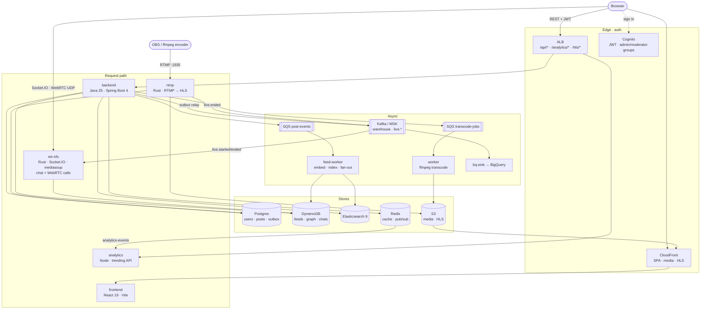
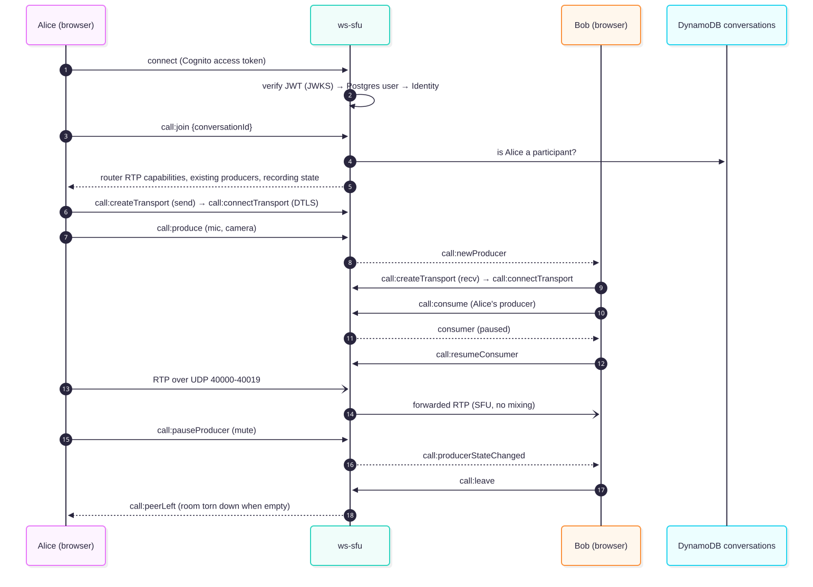
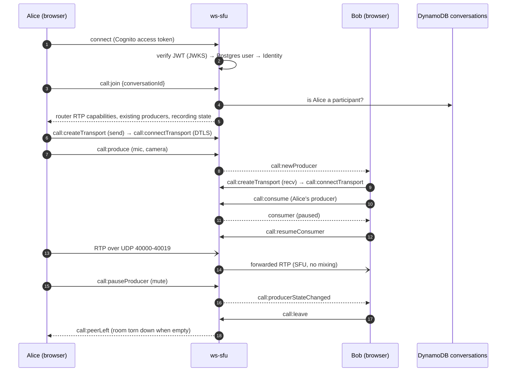
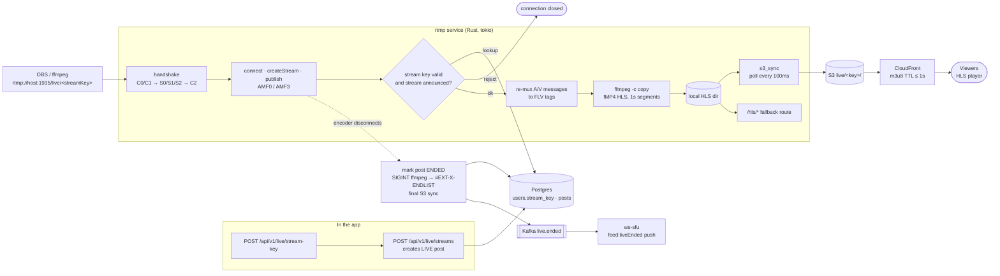

# escld diagrams

Rendered copies live in [`docs/images/`](images/). The prose behind each
diagram: [ARCHITECTURE.md](ARCHITECTURE.md), [WS_SFU.md](WS_SFU.md),
[RTMP.md](RTMP.md), [INFRASTRUCTURE.md](INFRASTRUCTURE.md).

## System architecture

Eight services around shared Postgres and a few purpose-specific stores.
Production shapes are shown (ALB, SQS, MSK, S3/CloudFront, Cognito); locally,
`docker-compose.yaml` emulates DynamoDB and SQS and runs real Postgres, Redis,
Elasticsearch and Kafka, but still uses the hosted Cognito pool.

## Video call setup (mediasoup via Socket.IO)

All signaling is custom Socket.IO events; media flows over UDP directly to
the SFU. One mediasoup Router per conversation, created on the first join.

## Going live: RTMP → HLS pipeline

